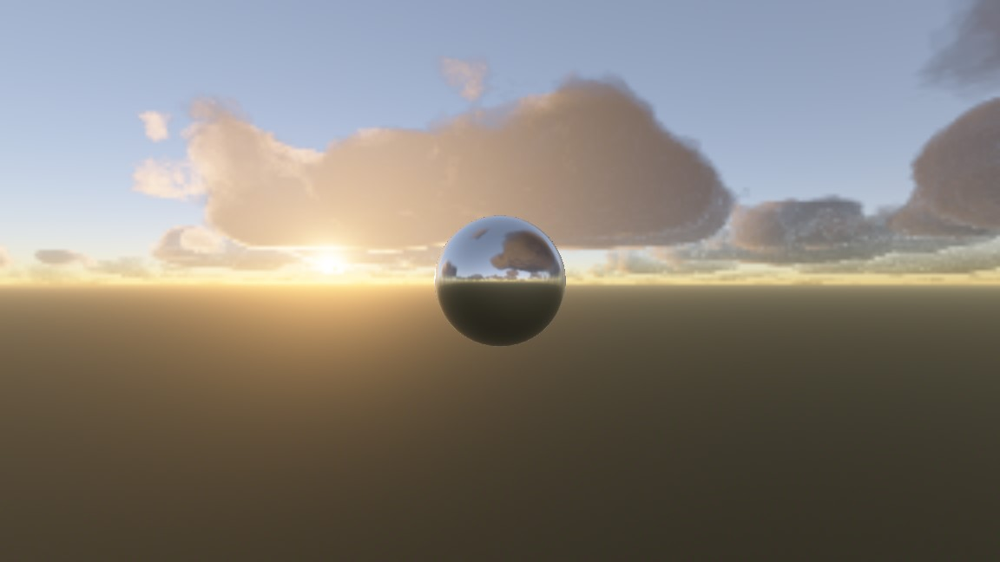

## Godot Sky Shader

Learning Resources:

[Coding Adventure: Atmosphere](https://www.youtube.com/watch?v=DxfEbulyFcY)

[Coding Adventure: Clouds](https://www.youtube.com/watch?v=4QOcCGI6xOU)

[Production Sky Rendering](https://www.shadertoy.com/view/slSXRW)

[Rendering volumetric clouds using signed distance fields](https://blog.uhawkvr.com/rendering/rendering-volumetric-clouds-using-signed-distance-fields/)
